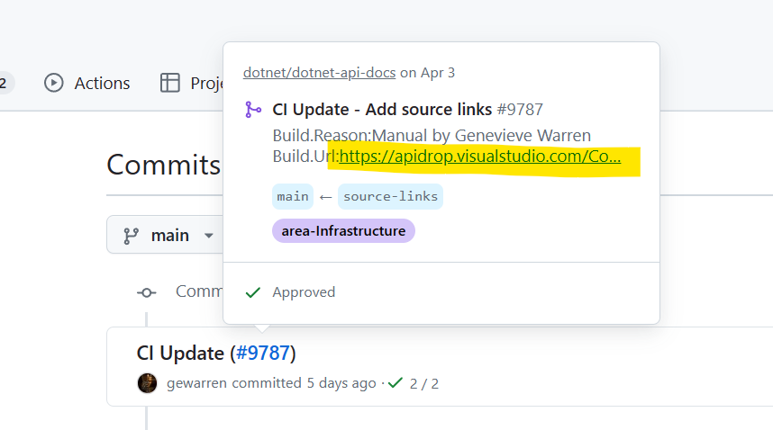

## Introduction

### Input

The input of mdoc is `dll`,`winmd` or `exe` which are organized in below folder structure.

```
|_dependencies
| |_version1
|   |-A.dependent.dll
|   |-B.dependent.dll
|_version1
  |-A.dll
  |_B.dll
```
In current production pipeline, not all the source repos have binaries in it. Some are the NuGet packages registered in csv file.

Example sources:
1. [binaries](https://apidrop.visualstudio.com/_git/binaries)
2. [mrefconfig](https://apidrop.visualstudio.com/binaries/_git/mrefconfig?path=/bundlepackages)
3. [content repo](https://github.com/Azure/azure-docs-sdk-dotnet/tree/main/bundlepackages)

We may not always be able to use the source repo as the input so the best way is to download the pipeline artifact to local to debug.
    
    

### Commands

There are 2 commands used in current production pipelines.

1. fx-bootstrap: generate `frameworks.xml` to the output folder
```dotnetcli
fx-bootstrap -fx {frameworks output folder} -importContent {true/false}
```
2. update: generate ECMAXMLs to the output folder
```dotnetcli
update -o {mdoc output folder} -fx {frameworks path} --debug -index false -lang docid -lang vb.net -lang fsharp -L "C:\Program Files (x86)\Windows Kits\10\References" -L "C:\Program Files (x86)\Microsoft.NET\Primary Interop Assemblies\msdatasrc.dll" -L "C:\Program Files\Microsoft Visual Studio\2022\Enterprise\Common7\IDE\PublicAssemblies" -L "C:\Program Files\dotnet" --delete
```

### Debug steps
1. Clone https://github.com/mono/api-doc-tools repo to local.
2. Open it in Visual Studio and make sure it is built successfully.
3. Set `mdoc` as the startup project.
4. Prepare the input folder in local disk.
    
5. Create two launch profiles, one for `fx-bootstrap` and one for `update`.
    
    
6. Locate the problematic piece of code.
7. Set a breakpoint and start to debug.

## Example
1. Partner reported a bug: https://ceapex.visualstudio.com/Engineering/_workitems/edit/896871
2. Analysis the bug and identify this is a mdoc issue.
3. Located the impacted .NET content repo: [dotnet-api-docs](https://github.com/dotnet/dotnet-api-docs).
4. Find the corresponding pipeline in the commit log. https://apidrop.visualstudio.com/Content%20CI/_build/results?buildId=422059&view=results
    
5. Since the source is not NuGet source, we can pull the source repo as our input.
6. Go to `Run .NET CI Script` step and find the source repo in the `paramsJson`
```
"https://apidrop.visualstudio.com/_git/binaries","branch":"master","folder":"dotnet"
```
7. Clone the source repo to local.
8. Select `fx-bootstrap` launch profile and run.
```dotnetcli
fx-bootstrap -fx "{local path}\binaries\dotnet"
```
9. The entry class of mdoc is [mdoc.cs](https://github.com/mono/api-doc-tools/blob/main/mdoc/Mono.Documentation/mdoc.cs) and the update command is in [MDocUpdater.cs](https://github.com/mono/api-doc-tools/blob/main/mdoc/Mono.Documentation/MDocUpdater.cs).
10. After analyzing the bug, you may want to set a breakpoint at:
    
11. Select `update` launch profile and start to debug.

## Tips
1. If you want to debug against a specific .dll, you can modify this line of [MDocUpdater.cs](https://github.com/mono/api-doc-tools/blob/f0bee064c5e018b82a39ec36a4c59d474fb154f9/mdoc/Mono.Documentation/MDocUpdater.cs#L367) 

    From
    ```
    var assemblyFiles = filters.Split('|').SelectMany(v => Directory.GetFiles(path, v));
    ```
    To
    ```
    var assemblyFiles = filters.Split('|').SelectMany(v => Directory.GetFiles(path, v)).Where(x => x.Contains("name-of-dll"));
    ```


